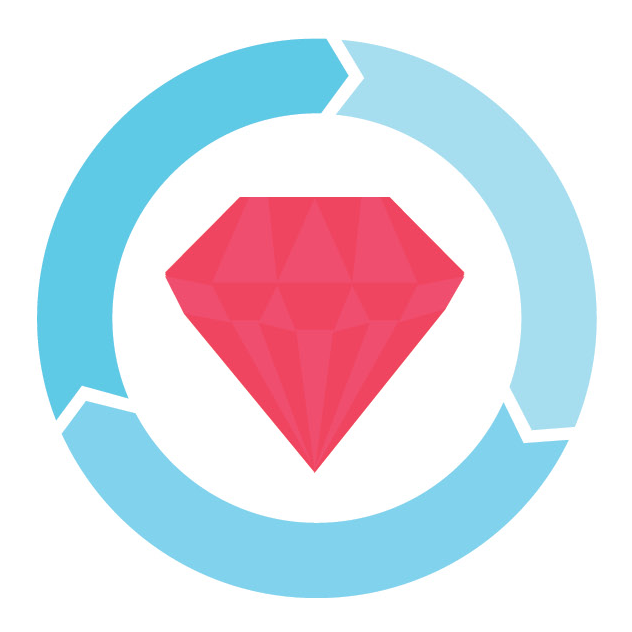

### Hello hello 👋

### Thanks for stopping by!

My name is Joe Mecha and I use he/him pronouns. I'm a developer specializing in back-end engineering with a keen interest in green tech and environmental organizations. I have a background in foreign languages and previously lived in Japan for 8 years. 

When I'm not coding, I'm often scrambling over a mountain ridge 🏔, going on a 'deer safari' with my dog 🐶, or playing a round of disc golf 🥏

## Ways to connect:

  
  
  
  

 
 
 

## Languages and Tools:

 
 
 

<!--
**joemecha/joemecha** is a ✨ _special_ ✨ repository because its `README.md` (this file) appears on your GitHub profile.

Here are some ideas to get you started:

- 🔭 I’m currently working on ...
- 🌱 I’m currently learning ...
- 👯 I’m looking to collaborate on ...
- 🤔 I’m looking for help with ...
- 💬 Ask me about ...
- 📫 How to reach me: ...
- 😄 Pronouns: ...
- ⚡ Fun fact: ...
-->

