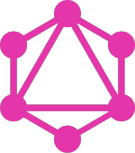

<!--  -->

## Joe Mecha (he/him) 

Hello hello! I'm a developer specializing in back-end engineering with a keen interest in purpose-driven organizations, especially in green tech and the environment.

- ⚙🔧 I’m currently working on: __[WalkSafe](https://github.com/Walk-Safe)__

- ☀️🌱 I’m currently learning: __GraphQL__ and __JavaScript__ 

- ✌️ When not coding I'm usually: scrambling over a mountain ridge 🏔

## Let's connect!

  
  
  
  

 
 
 

## Languages and Tools:

<a href="https://www.ruby-lang.org/en/" target="blank"><a/>
<a href="https://rubyonrails.org" target="blank"><a/>
<a href="https://www.postgresql.org" target="blank"><a/>
<a href="https://rspec.info/" target="blank"><a/>
<a href="https://www.w3schools.com/css/" target="blank"><a/>
<a href="https://www.w3.org/html/" target="blank"><a/>
<a href="https://getbootstrap.com/" target="blank"><a/>
<a href="https://git-scm.com/" target="blank"><a/>
<a href="https://github.com/" target="blank"><a/>
<a href="https://travis-ci.org" target="blank"><a/>
<a href="https://heroku.com" target="blank"><a/>
<a href="https://postman.com" target="_blank"> <a/>
<a href="https://atom.io/" target="blank"><a/>
<a href="https://code.visualstudio.com/" target="blank"><a/>
<a href="https://www.adobe.com/products/photoshop.html" target="blank"><a/>
<a href="https://www.gimp.org/" target="blank"><a/>

 
 

<!--
**joemecha/joemecha** is a ✨ _special_ ✨ repository because its `README.md` (this file) appears on your GitHub profile.

Here are some ideas to get you started:

- 👯 I’m looking to collaborate on ...
- 🤔 I’m looking for help with ...
- 💬 Ask me about ...
- 📫 How to reach me: ...
- 😄 Pronouns: ...
- ⚡ Fun fact: ...
-->
